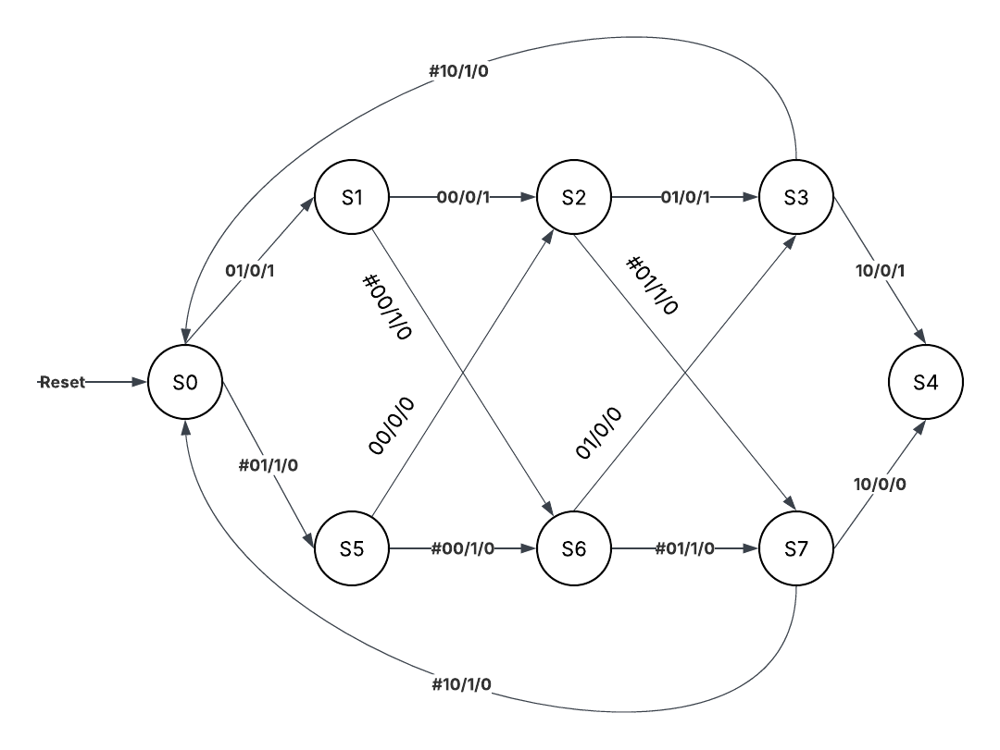
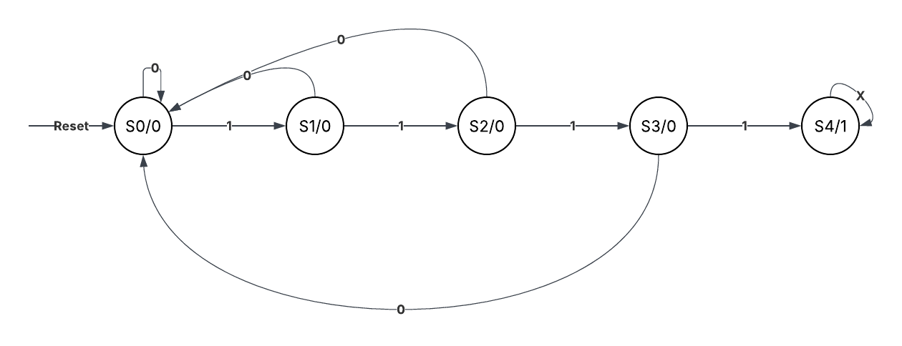
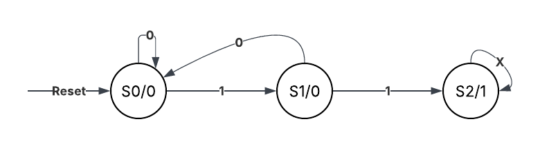
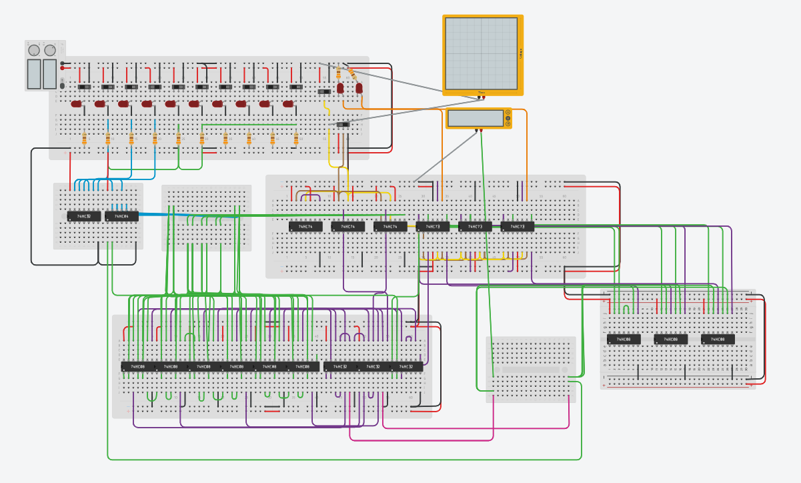

# Digital Electronic Lock System (Logic Design)
# デジタル電子錠システムの論理回路設計

**Project Status:** Completed (Jan 2025)  
**Role:** Individual Project (Hardware Logic Design)

## 1. Overview (概要)
This project is a simulation of a digital password lock system (Passcode: **2-0-2-3**) designed purely with **Logic Gates** and **Flip-Flops**, without using any microcontrollers.

TinkerCADを用いた「デジタル暗証番号ロックシステム（パスワード：2023）」のシミュレーション設計です。
マイコンを使わず、論理ゲートとフリップフロップだけで3つのサブシステム（認識・制御・警報）を連携させ、ハードウェアレベルで実装しました。

### 🔗 [Click here to run Simulation on TinkerCAD](https://www.tinkercad.com/things/bWv04wIoOe6-cui-ki-in-t-cho-cntt?sharecode=G7y2xH1ShoAoVC4qLZa1cn7bWNmS80ofVblFm5esdfM)

---

## 2. Key Features (こだわりポイント)

* **Modular Design (モジュール設計):**
    The system is divided into 3 independent state machines for better stability:
    1.  **Sequence Recognizer (Mealy):** Detects "2-0-2-3".
    2.  **Unlock Controller (Moore):** Manages the lock state.
    3.  **Error Handler (Moore):** Triggers alarm after 2 wrong attempts.

* **Input Optimization (入力の最適化):**
    * Encoded 10 decimal keys (0-9) into **2-bit signals** to minimize logic gates.
    * 10個のキー入力を2ビット信号にエンコードし、回路規模を最小化しました。

---

## 3. System Architecture & State Definitions (システム設計と状態定義)

Detailed logic of the 3 State Machines designed in this project.
(本プロジェクトで設計した3つのステートマシンの詳細ロジック)

### A. Sequence Recognizer (Mealy Machine)
* **Function:** Detects the input sequence **2 -> 0 -> 2 -> 3**.
* **Inputs:** $A_1A_0$ (2-bit Encoded Keypad Input).
* **Outputs:**
    * $Y_1$: Step Match (1 = Current input matches the expected step).
    * $Y_0$: Sequence Match (1 = Current & Previous inputs match).
* **Transition Notation:** `Input(A1A0) / Output(Y1) / Output(Y0)`

| State Code ($Q_2Q_1Q_0$) | State Name | Description (状態の説明) |
| :---: | :---: | :--- |
| **000** | $S_0$ | **Reset / Idle:** Waiting for start or Invalid input. |
| **001** | $S_1$ | **Step 1 OK:** Input was `01` (Key '2'). |
| **010** | $S_2$ | **Step 2 OK:** Input was `00` (Key '0'). |
| **011** | $S_3$ | **Step 3 OK:** Input was `01` (Key '2'). |
| **100** | $S_4$ | **Step 4 OK:** Input was `10` (Key '3') -> **Full Sequence Detected.** |
| **101** | $S_5$ | **Error 1:** Wrong input at Step 1 (Input $\neq$ 01). |
| **110** | $S_6$ | **Error 2:** Wrong input at Step 2 (Input $\neq$ 00). |
| **111** | $S_7$ | **Error 3:** Wrong input at Step 3 (Input $\neq$ 01). |

---

### B. Unlock Controller (Moore Machine)
* **Function:** Tracks the progress of correct inputs to unlock the door.
* **Input:** $Y_0$ (Sequence Match Signal from Recognizer).
* **Logic:** Unlocks only when $Y_0=1$ occurs 4 times sequentially.

| State Code | State Name | Description (状態の説明) |
| :---: | :---: | :--- |
| **000** | $S_0$ | **Reset:** Initial state ($Y_0 = 0$). |
| **001** | $S_1$ | **Progress 25%:** $Y_0=1$ (1st time). |
| **010** | $S_2$ | **Progress 50%:** $Y_0=1$ (2nd time). |
| **011** | $S_3$ | **Progress 75%:** $Y_0=1$ (3rd time). |
| **100** | $S_4$ | **UNLOCK:** $Y_0=1$ (4th time). Door Open. |

---

### C. Error Handler (Moore Machine)
* **Function:** Counts mistakes and triggers alarm.
* **Input:** $Y_1$ (Step Match Signal).
* **Logic:** If $Y_1=0$ (Mismatch), increment error count.

| State Code | State Name | Description (状態の説明) |
| :---: | :---: | :--- |
| **00** | $S_0$ | **Safe:** No error or Reset ($Error = 0$). |
| **01** | $S_1$ | **Warning:** 1st Wrong Input ($Error = 1$). |
| **10** | $S_2$ | **ALARM:** 2nd Wrong Input ($Error = 2$). **System Locked.** |

## 4. Circuit Diagram (TinkerCAD)

---

## 5. Tech Stack
* **Simulation:** TinkerCAD
* **Components:** D Flip-Flop (74HC74), JK Flip-Flop (74HC73), Logic Gates (AND/OR/NOT).
* **Theory:** Finite State Machine (Mealy/Moore), Karnaugh Map Optimization.

## 6. Hardware Components (使用パーツ)
Based on the actual simulation BOM.

* **Logic ICs (Standard CMOS 74HC Series):**
    * **74HC08** (Quad 2-input AND Gate) x 9
    * **74HC32** (Quad 2-input OR Gate) x 4
    * **74HC04** (Hex Inverter/NOT Gate) x 1
* **Flip-Flops (Memory Units):**
    * **74HC74** (Dual D-Type Flip-Flop) x 3
    * **74HC73** (Dual J-K Flip-Flop) x 3
* **I/O & Power:**
    * **Slide Switches** (Input Keypad 0-9) x 12
    * **Red LEDs** (Status Indicators) x 12
    * **330Ω Resistors** (Current Limiting) x 12
    * **5V Power Supply** (DC Source)

## 7. Report
👉 [Download Full PDF Report (Vietnamese)](report/Digital_Lock_Report.pdf)
